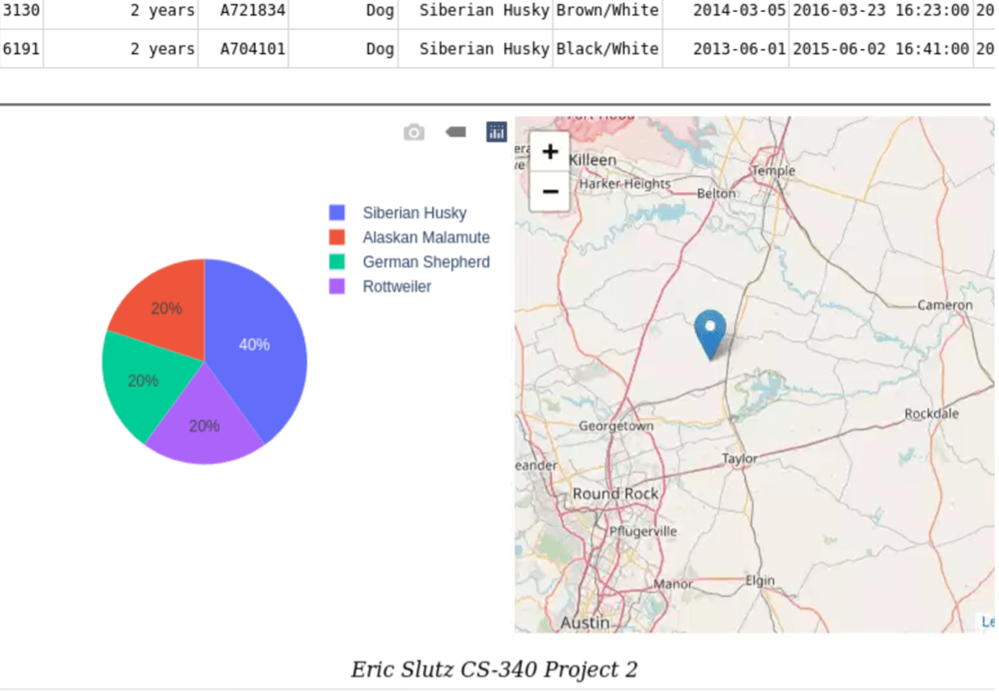

# CS-340-Portfolio

Portfolio containing the project from CS-340 Client/Server Development.

- Code
  - [Dashboard](../ProjectTwoDashboard.ipynb)
  - [CRUD Module](../module/animal_shelter.py)
- [About](#about)
  <!-- - [Animal Shelter Project](#animal-shelter-project)
  - [Motivation](#motivation)
  - [Purpose](#purpose-of-the-crud-python-module) -->
- [Getting Started](#getting-started)
- [How To Use](#how-to-use-the-crud-module)
- [Dashboard Functionality](#dashboard-functionality)
  <!-- - [Filter: All](#filter-all)
  - [Filter: Water Rescue](#filter-water-rescue)
  - [Filter: Mountain or Wilderness Rescue](#filter-mountain-or-wilderness-rescue)
  - [Filter: Disaster or Individual Tracking](#filter-disaster-or-individual-tracking) -->
- [Tools Used](#tools-used)
  <!-- - [MongoDb](#mongodb)
  - [Python](#python)
  - [PyMongo](#pymongo)
  - [Dash Framework](#dash-framework) -->

## About

### Animal Shelter Project

The Animal Shelter project creates a package that Python module the provides CRUD (create, read, update, delete) services to the animals collection in the AAC database.

### Motivation

This project exists to make it easier for a user to interact programmatically with the animal collection in the AAC database.  This includes making it easy for the user to connect to the database, create new documents in the database, and read from the database.

### Purpose of the CRUD Python Module

The purpose of a CRUD Python module is to have reusable code to connect to a database and perform create, read, update, and delete operations on the database.

## Getting Started

To get a local copy up and running, follow these steps:

1. Start the MongoDB service

    ```zsh
    mongod
    ```

1. Import the “aac_shelter_outcomes.csv” dataset using the following command

    ```zsh
    mongoimport --port <PORT#> --db AAC --collection animals --type=csv --headerline  <PATH_TO_CSV>aac_shelter_outcomes.csv
    ```

1. Launch the Mongo shell and create the admin and aacuser

    ```zsh
    mongosh
    db.createUser({user:’admin’,pwd:passwordPrompt(),roles:[{role:’userAdminAnyDatabase’,db:’admin’},’readWriteAnyDatabase’]})
    db.createUser({user:’aacuser’,pwd:passwordPrompt(),roles:[{role:’readWrite’,db:’AAC’ }]})
    ```

1. Restart MongoDB service with auth

    ```zsh
    mongod --shutdown
    mongod
    ```

1. From here you can open your Python IDE and install the Animal Shelter package and create a new instance to connect to the database

    ```python
    client = AnimalShelter (<USER>, <PASSWORD>, <PORT>, <AUTH_SRC>)
    ```

## How To Use the CRUD Module

This module used PyMongo, the Python driver for Mongo, to interact with the database.  This is the official Python driver from MongoDB, which means it has a lot of features and is well documented and supported.

- `AnimalShelter(username, password, port = 27017, auth_src_db = 'admin')`
The constructor is used to make the initial connection to the database.  The username and password parameters are for logging a user into the database.  The port parameter has a default value for the default port on a MongoDB instance.  A different value can be passed if the default port is not used.  The auth_src_database is for specifying which database contains the record for the user login.  It has a default value for referencing the admin database.

- `create(data)`
The create method has a data parameter.  This parameter contains the document you want created in the database.  The method returns true if the insert is successful and false if it is not.

- `read(query)`
The read method has a query parameter.  The parameter contains the query to be run for a search of the database.  If any matches are found, they are returned.

- `update(key, data)`
The update method has a key and data parameters.  The key is the query to match against.  Any documents that are found that match the key are then updated with the value from the data parameter.  The method returns how many documents matched the key and how many documents were updated.

- `delete(key)`
The delete method has a key parameter.  The key is the query to match against.  Any documents that are found that match the key are then deleted.  The method returns the number of documents that were deleted.

## Dashboard Functionality

### Filter: All

This resets the filter and displays all animals in the table, updating the widgets accordingly.


### Filter: Water Rescue

This filters to display dogs that meet the requirements for water rescue in the table, updating the widgets accordingly.


### Filter: Mountain or Wilderness Rescue

This filters to display dogs that meet the requirements for mountain or wilderness rescue in the table, updating the widgets accordingly.




### Filter: Disaster or Individual Tracking

This filters to display dogs that meet the requirements for disaster or individual tracking in the table, updating the widgets accordingly.


## Tools Used

### MongoDB

[mongodb.com](https://www.mongodb.com)

MongoDB is a good choice for use with frontend programs.  Instead of having to define columns and rows, each record is stored as a document containing all of its own properties and values.  This lends itself well to creating interactive dashboards for displaying data.

### Python

[python.org](https://www.python.org)

Python was chosen for this project due to its ease of use and the wide availability of support and add on features and libraries.

### PyMongo

[pymongo.readthedocs.io](https://pymongo.readthedocs.io/en/stable/)

PyMongo is the recommend driver for using Python to interact with MongoDb.

### Dash Framework

[plotly.com/dash](https://plotly.com/dash/)

Dash is a Python framework that works well for creating web-based dashboards to display data.